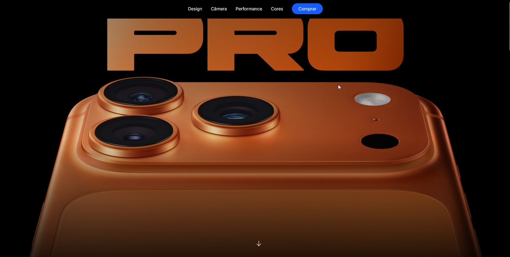

# 📱 Clone iPhone 17

Um projeto moderno desenvolvido com **React** e **Tailwind CSS**, inspirado no design elegante e minimalista do iPhone 17.  
O foco deste projeto é demonstrar animações fluidas, responsividade e boas práticas de UI/UX com tecnologias front-end atuais.

---

## 🚀 Deploy

O projeto está hospedado na **Vercel** e pode ser acessado no link abaixo:

🔗 **[clone-iphone-17.vercel.app](https://vercel.com/wooolys-projects/clone-iphone-17)**

---

## 🖼️ Preview

---

## 🧰 Tecnologias Utilizadas

- ⚛️ **React** – Biblioteca JavaScript para construção de interfaces dinâmicas.
- 🎨 **Tailwind CSS** – Framework CSS utilitário para estilização rápida e responsiva.
- 🌐 **Vercel** – Plataforma de deploy contínuo e hospedagem serverless.
- 🧩 **Vite / Create React App** – Ferramenta de build rápida (dependendo do setup escolhido).
